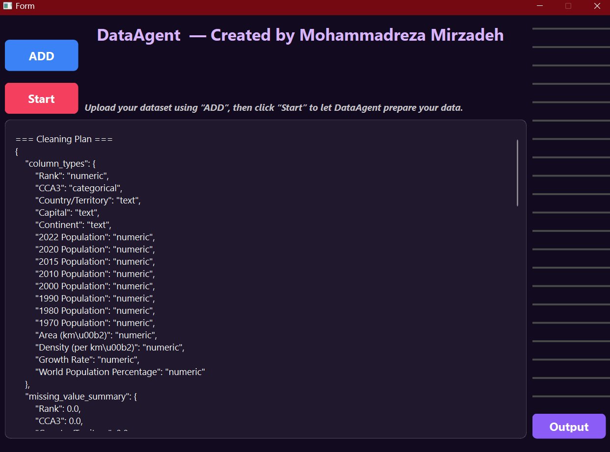

# DataAgent

**AI-powered data cleaning agent using a lightweight local reasoning model (DeepSeek-R1-mini) for automatic type detection, semantic understanding, and clean CSV export.**  
DataAgent analyzes raw datasets, interprets column types through local LLM reasoning, applies safe preprocessing steps, fixes missing values, encodes categorical features, and produces a fully cleaned dataset ready for analysis or machine learning.

---

## 📸 Screenshot

Below is a preview of the DataAgent UI:

---

# 🔄 Versions

This repository contains two major versions of the DataAgent system:

## **v1 — Original Implementation**
- First working version of the agent  
- Basic rule-based cleaning  
- Limited logging  
- No duration parsing  
- No semantic understanding  
- No ML-based missing value imputation  
- Suitable for small/simple datasets  

## **v2 — Improved & Stable Version (Recommended)**
- Fully redesigned cleaning engine  
- Clear, human-readable logs  
- Robust duration parsing (`duration_minutes` + `duration_seasons`)  
- ML-powered missing value imputation  
- Strong validation layer  
- Improved DeepSeek reasoning prompt  
- Stable behavior across all tested datasets  
- Successfully tested on:
  - Netflix Titles  
  - Titanic  
  - Iris  
  - World Population  

> **v2 is the recommended version for real-world use.**

---

## 🚀 Features

- **LLM-powered column type detection**  
  Automatically identifies numeric, categorical, text, and datetime columns using dataset preview + model reasoning.

- **Semantic cleaning engine**  
  Applies intelligent rules based on column names (e.g., duration parsing, long-text handling, ticket/cabin patterns).

- **Safe missing-value handling**  
  - Numeric → median  
  - Categorical → mode  
  - Datetime → forward-fill  
  - Text → empty string  

- **Automatic categorical encoding**  
  Lightweight encoder without sklearn/scipy dependencies.

- **Skewness correction**  
  Log-transform applied to highly skewed numeric columns (except population/area/density/rank fields).

- **Automatic datetime conversion**

- **Exports clean CSV**  
  Output saved in `/outputs/cleaned_data.csv`.

- **PyQt desktop interface**  
  Simple UI for loading datasets, previewing structure, cleaning, and exporting results.

---

---

## 🧠 How It Works

1. **Preview Phase**  
   The agent loads the dataset and generates a structured preview (dtypes, null counts, head, etc.).

2. **Reasoning Phase**  
   A lightweight LLM receives the preview and returns a JSON plan describing:
   - column types  
   - missing-value ratios  
   - high-cardinality columns  
   - datetime detection  

3. **Cleaning Phase**  
   The agent applies:
   - type corrections  
   - datetime parsing  
   - semantic rules  
   - missing-value handling  
   - categorical encoding  
   - skewness correction  
   - removal of fully-empty columns  

4. **Export Phase**  
   Cleaned dataset is saved to `/outputs/cleaned_data.csv`.

---

## 🖥️ Running the Application

### **Method 1 — Run with Python**
python main.py

### **Method 2 — Run without console (pythonw)**
pythonw main.py

---

## 📦 Requirements

pandas
numpy
requests
PyQt6

> No sklearn or scipy required.

---

## 🧪 Sample Datasets

The `Tests/` folder contains cleaned versions of common public datasets:

- Titanic  
- World Population  
- Iris  
- Netflix Titles  

These are included for demonstration and testing purposes.

---

## 📝 License

This project uses public datasets and is intended for educational and research use.

---

# معرفی

این برنامه یک دستیار هوشمند برای پاک‌سازی و آماده‌سازی داده‌هاست.  
سامانه با تحلیل اولیه‌ی جدول، نوع ستون‌ها را تشخیص می‌دهد، مقادیر خالی را به‌صورت ایمن اصلاح می‌کند، ستون‌های متنی و عددی را سامان‌دهی می‌کند و در پایان یک نسخه‌ی تمیز از داده را ذخیره می‌کند.

---

## امکانات

- تشخیص خودکار نوع ستون‌ها با کمک مدل هوشمند  
- پاک‌سازی معنایی بر اساس نام ستون‌ها  
- اصلاح مقادیر خالی با روش‌های ایمن  
- سامان‌دهی ستون‌های دسته‌ای  
- اصلاح کجی داده‌های عددی  
- تبدیل خودکار ستون‌های زمانی  
- ذخیره‌ی نسخه‌ی تمیز در پوشه‌ی خروجی  
- دارای رابط کاربری ساده و روان

---

## اجرا

اجرای معمول:
python main.py

